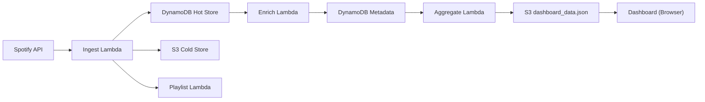

# Spotify Lifecycle Manager

Serverless pipeline for Spotify listening analytics that ingests play history, deduplicates events, builds weekly playlists, and serves a zero-query dashboard.

[](LICENSE)
[](https://www.python.org/downloads/)

## Live Demo

- Repo: <https://github.com/kklike32/Spotify-Lifecycle-Manager>
- Dashboard: <https://d25spyc5nz22ju.cloudfront.net>

## Features

- Cursor-based ingestion to avoid gaps in play history
- Idempotent processing and dedupe keys
- Hot store (DynamoDB) + cold store (S3) retention strategy
- Precomputed, static dashboard JSON for zero-query reads
- Weekly playlist automation (“not played in last N days”)

## Tech Stack

- Python 3.11+, Spotipy
- AWS Lambda, EventBridge, DynamoDB, S3, CloudWatch
- Terraform (infra)
- Static dashboard (HTML/CSS/JS)

## Architecture



## Setup

### Prerequisites

- Spotify Developer App (Client ID + Client Secret)
- AWS account with credentials configured locally
- Terraform 1.0+
- Python 3.11+ (recommended: `uv`)

### Environment Variables

Copy `.env.example` to `.env` for local scripts only (never commit `.env`).

| Variable | Required | Purpose |
| --- | --- | --- |
| `SPOTIFY_CLIENT_ID` | Yes | Spotify app client ID |
| `SPOTIFY_CLIENT_SECRET` | Yes | Spotify app client secret |
| `SPOTIFY_REFRESH_TOKEN` | Yes | OAuth refresh token for non-interactive runs |
| `SOURCE_PLAYLIST_ID` | Yes | Seed playlist ID for weekly playlist generation |
| `LOOKBACK_DAYS` | No | Recent-play lookback window (default 7) |
| `AGGREGATION_FREQUENCY_DAYS` | No | Aggregate window (default 7) |
| `USER_ID` | No | Spotify user ID (`me` supported) |
| `AWS_REGION` | No | AWS region (default `us-east-1`) |
| `HOT_TABLE_NAME` | No | DynamoDB hot table name |
| `TRACKS_TABLE_NAME` | No | DynamoDB tracks table name |
| `ARTISTS_TABLE_NAME` | No | DynamoDB artists table name |
| `STATE_TABLE_NAME` | No | DynamoDB state table name |
| `RAW_BUCKET_NAME` | No | S3 raw data bucket |
| `DASHBOARD_BUCKET_NAME` | No | S3 dashboard bucket |
| `ENVIRONMENT` | No | Environment label (e.g., `development`) |
| `DASHBOARD_DATA_URL` | No | Dashboard JSON URL for local UI testing |

### Spotify OAuth (refresh token)

Follow the Spotify OAuth guide in `scripts/run_ingest.py` or use your preferred flow to obtain a refresh token. Store refresh tokens in AWS SSM Parameter Store for production use.

## Deploy

### Terraform

```bash
cd infra/terraform
cp terraform.tfvars.example terraform.tfvars
# edit terraform.tfvars with your values
terraform init
terraform apply
```

### Store Secrets in SSM

```bash
aws ssm put-parameter \
  --name "/spotify-lifecycle/spotify/client_id" \
  --value "YOUR_CLIENT_ID" \
  --type "SecureString"

aws ssm put-parameter \
  --name "/spotify-lifecycle/spotify/client_secret" \
  --value "YOUR_CLIENT_SECRET" \
  --type "SecureString"

aws ssm put-parameter \
  --name "/spotify-lifecycle/spotify/refresh_token" \
  --value "YOUR_REFRESH_TOKEN" \
  --type "SecureString"
```

### Deploy App Components

```bash
./scripts/deploy.sh all
# or
./scripts/deploy.sh lambda
./scripts/deploy.sh dashboard
```

## Local Development

```bash
uv venv
uv sync
uv run pytest -q
```

Dashboard (static):

```bash
# Serve dashboard locally (simple option)
python -m http.server --directory dashboard/site 8000
```

## Data & Privacy

- Stored: track/artist metadata, play history events, and derived aggregates
- Not stored: audio content, user passwords, or Spotify credentials in code
- Tokens: refresh token should live in SSM Parameter Store for production
- Retention: hot store uses TTL (default 7 days); cold store persists until deleted
- Deletion: remove your S3 objects and DynamoDB tables to purge data

## Costs

Designed to be near-zero cost for personal use when using infrequent schedules and low data volumes. Costs rise with higher ingest frequency, long-term S3 retention, and CloudWatch logs.

## Troubleshooting

- CORS errors: confirm CloudFront/S3 CORS settings and dashboard URL
- Spotify 429: lower ingest frequency or add backoff
- Missing history: verify cursor state and lookback window
- Empty dashboard: confirm aggregate Lambda writes to S3

## Roadmap

- OAuth bootstrap CLI
- Multi-user support
- Optional Athena queries for ad-hoc analysis

## Contributing

See `CONTRIBUTING.md` for setup, tests, and PR guidelines.

## License

MIT — see `LICENSE`.
